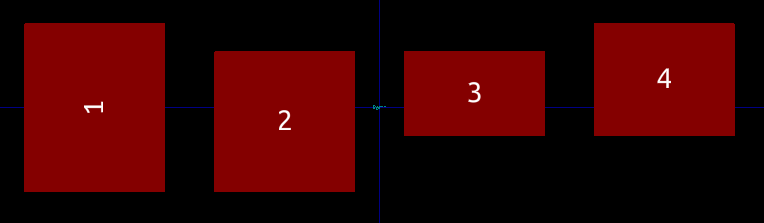

# footwork-ecad
Experiments in parametric, constraint-based electrical footprint design.
Parametric and constraint-based footprints allow for:

- Avoiding error-prone manual calculation
- Easy transfer of dimensions from datasheets
- Easy design of complicated footprints thanks to a simple visual metaphor
- Generic footprints which can be adapted to tolerances and environments

## Current status

This is currently experimental and still work-in-progress, current tasks are:

- Design basic API for constructing footprints
- Design file format
- Design UI for interactive drawing

Currently, the API is being worked upon.

# Use case

Imagine a footprint layout which requires alignment between the edges of the pads.
For example, in the below the top and bottom edges of the footprints are aligned in pairs.

Calculating the needed widths, heights and coordinates is might not necessarily be difficult, but it is error-prone, tedious and manual.
Scripts which manually perform these calculations only really solve the "manual" part of the problem, since these scripts are footprint specific.

Geometric constraint solving allows for defining the elements (in this case pads) and constraints (aligment, sizes) and then let a optimization algorithm find a solution.
The above footprint is defined by 4 pads, 4 lines and 15 constraints and a solution is found in less than a millisecond.

# Running the example

Requires Python 3.

 - Follow the instructions to build https://github.com/KmolYuan/python-solvespace
 - Copy `libslvs.so`, `slvs.py` and `_slvs.so` to the `footwork` directory
 - Run `make test`

In the console the coordinates of the points should be printed.

